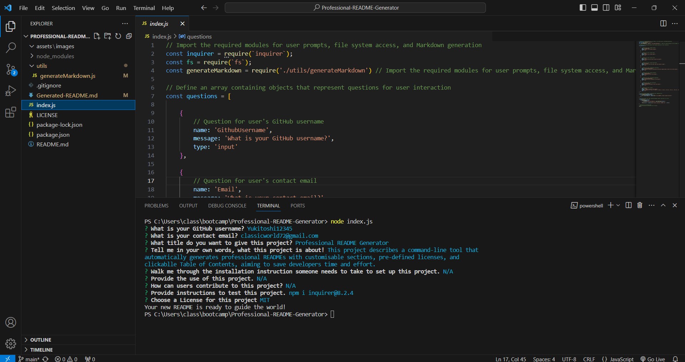

 

# <h1 align = "center"> Professional README Generator </h1>
Introducing a command-line application designed to efficiently generate professional README.md files for new software projects. This tool streamlines the documentation process by prompting users for key information and automatically constructing a well-formatted README with relevant sections like Description, Installation Instructions, Usage Information, Contribution Guidelines, Test Instructions, License, and Questions. Users can customize their README by providing specific content for each section, selecting a license from a pre-defined list, and including their GitHub username and email address for contact. Additionally, the generated README features a clickable Table of Contents for easy navigation. This application aims to save developers time and effort by automating the creation of high-quality project documentation.

## Table of Contents

- [User Story](#user-story)
- [Acceptance Criteria](#acceptance-criteria)
- [Technologies Used](#technologies-used)
- [Video](#video)
- [Output](#output)
- [Installation](#installation)

## User Story

```md
AS A developer
I WANT a README generator
SO THAT I can quickly create a professional README for a new project
```

## Acceptance Criteria

```md
GIVEN a command-line application that accepts user input
WHEN I am prompted for information about my application repository
THEN a high-quality, professional README.md is generated with the title of my project and sections entitled Description, Table of Contents, Installation, Usage, License, Contributing, Tests, and Questions
WHEN I enter my project title
THEN this is displayed as the title of the README
WHEN I enter a description, installation instructions, usage information, contribution guidelines, and test instructions
THEN this information is added to the sections of the README entitled Description, Installation, Usage, Contributing, and Tests
WHEN I choose a license for my application from a list of options
THEN a badge for that license is added near the top of the README and a notice is added to the section of the README entitled License that explains which license the application is covered under
WHEN I enter my GitHub username
THEN this is added to the section of the README entitled Questions, with a link to my GitHub profile
WHEN I enter my email address
THEN this is added to the section of the README entitled Questions, with instructions on how to reach me with additional questions
WHEN I click on the links in the Table of Contents
THEN I am taken to the corresponding section of the README
```


## Technologies Used
- JavaScript
- Node.js

## Screenshot



## Video


## Output
Running the README generator fulfills your wish for a quick and professional README for your new project. The resulting README.md boasts a compelling title you define, a handy clickable Table of Contents, and informative sections covering your project's Description, Installation Instruction, Usage Information, Contribution Guidelines, Test instructions, Licensing Terms (with a badge and explanation), and even your contact information via GitHub username and email address. This comprehensive and well-formatted README is ready to be shared and integrated into your project repository, saving you time, effort, and enhancing your project's professional image.

## Installation
The project was uploaded to [GitHub](https://github.com/) at the following repository:
[https://github.com/yukitoshi12345/Professional-README-Generator/](https://github.com/yukitoshi12345/Professional-README-Generator)

